# SQL Employee Database Assignment

## Overview

This project is a solution to an SQL Practical Examination using **PostgreSQL** and **pgAdmin 4**.
The project demonstrates SQL concepts such as filtering, sorting, aggregate functions, joins, grouping, and subqueries.

---

## Tools Used

- PostgreSQL
- pgAdmin 4
- Visual Studio Code
- Git
- GitHub

---

## Project Structure

```
SQL-Assignment
│
├── database.sql
├── queries.sql
├── README.md
└── output
```

---

## Database Tables

### Employee

- empid
- ename
- gender
- salary
- city

### EmployeeDetails

- empid
- projects
- empposition
- doj

---

## SQL Concepts Covered

- CREATE TABLE
- INSERT INTO
- SELECT
- WHERE
- LIKE
- ORDER BY
- GROUP BY
- Aggregate Functions
- INNER JOIN
- Subqueries
- OFFSET
- LIMIT

---

## Questions Solved


# Q1. Display employee name, salary and city where salary is greater than 50000

### SQL Query

```sql
SELECT
    ename,
    salary,
    city
FROM Employee
WHERE salary > 50000;
```

### Output

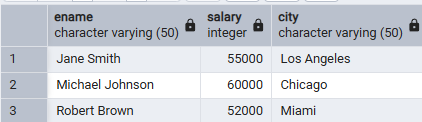

---

# Q2. Display employees whose names start with the letter 'J'

### SQL Query

```sql
SELECT *
FROM Employee
WHERE ename LIKE 'J%';
```

### Output

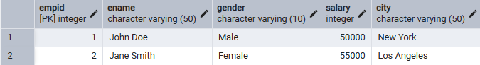

---

# Q3. Find employees who belong to either New York or Chicago

### SQL Query

```sql
SELECT *
FROM Employee
WHERE city IN ('New York','Chicago');
```

### Output

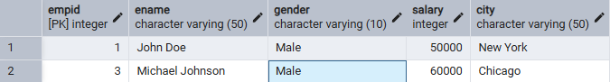

---

# Q4. Display employee details in descending order of salary

### SQL Query

```sql
SELECT *
FROM Employee
ORDER BY salary DESC;
```

### Output

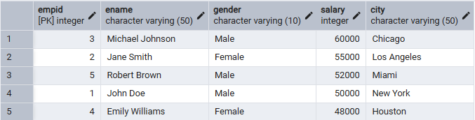

---

# Q5. Find the total salary paid to all employees

### SQL Query

```sql
SELECT
SUM(salary) AS total_salary
FROM Employee;
```

### Output

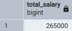

---

# Q6. Find the average salary of male and female employees separately

### SQL Query

```sql
SELECT
gender,
AVG(salary) AS average_salary
FROM Employee
GROUP BY gender;
```

### Output

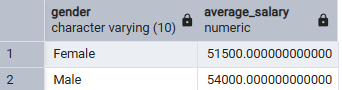

---

# Q7. Find the maximum and minimum salary in the employee table

### SQL Query

```sql
SELECT
MAX(salary) AS maximum_salary,
MIN(salary) AS minimum_salary
FROM Employee;
```

### Output


---

# Q8. Display employee name along with project and designation using JOIN

### SQL Query

```sql
SELECT
e.ename,
ed.projects,
ed.empposition
FROM Employee e
INNER JOIN EmployeeDetails ed
ON e.empid = ed.empid;
```

### Output

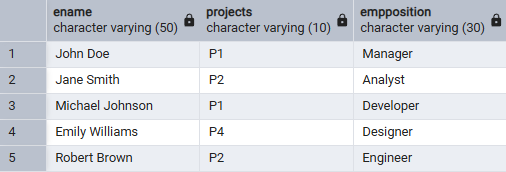

---

# Q9. Find employees working on Project P1

### SQL Query

```sql
SELECT
e.ename,
ed.projects
FROM Employee e
INNER JOIN EmployeeDetails ed
ON e.empid = ed.empid
WHERE ed.projects = 'P1';
```

### Output

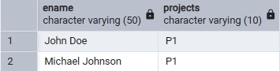

---

# Q10. Display all employees who joined after 1st February 2022

### SQL Query

```sql
SELECT
e.ename,
ed.doj
FROM Employee e
INNER JOIN EmployeeDetails ed
ON e.empid = ed.empid
WHERE ed.doj > '2022-02-01';
```

### Output

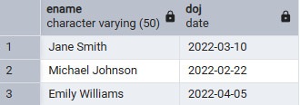

---

# Q11. Find the employee with the second highest salary

### SQL Query

```sql
SELECT
    ename,
    salary
FROM Employee
WHERE salary = (
    SELECT DISTINCT salary
    FROM Employee
    ORDER BY salary DESC
    OFFSET 1
    LIMIT 1
);
```

### Output

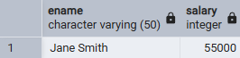

---

# Q12. Find employees whose salary is higher than the average salary

### Step 1: Find Average Salary

```sql
SELECT
AVG(salary) AS average_salary
FROM Employee;
```

### Step 2: Find Employees

```sql
SELECT
ename,
salary
FROM Employee
WHERE salary >
(
SELECT AVG(salary)
FROM Employee
);
```

### Output

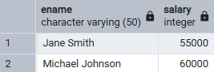

---

# Q13. Find the number of employees working on each project

### SQL Query

```sql
SELECT
projects,
COUNT(*) AS total_employees
FROM EmployeeDetails
GROUP BY projects;
```

### Output

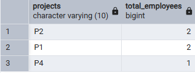

---

# Q14. Display the highest-paid employee in every project

### SQL Query

```sql
SELECT
    ed.projects,
    e.ename,
    e.salary
FROM Employee e
JOIN EmployeeDetails ed
ON e.empid = ed.empid
WHERE (ed.projects, e.salary) IN
(
    SELECT
        ed2.projects,
        MAX(e2.salary)
    FROM Employee e2
    JOIN EmployeeDetails ed2
    ON e2.empid = ed2.empid
    GROUP BY ed2.projects
)
ORDER BY ed.projects;
```

### Output

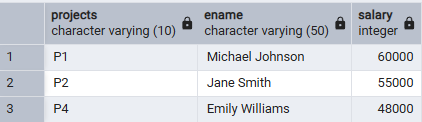

---

---

## Output

Screenshots for every query are available in the **output** folder.

---

## Author

MANISH KUMAR
